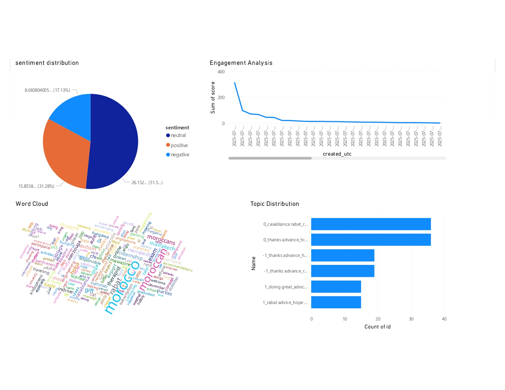

# End-to-End Subreddit Streaming Analytics with Spark and Power BI

A real-time streaming pipeline that analyzes Reddit data using Apache Spark, Kafka, and advanced NLP techniques including sentiment analysis and topic modeling.

## Architecture

The following diagram illustrates the architecture of the Reddit Community Radar pipeline:


The Spark architecture is configured in **Client Mode**, where the driver runs on the local machine and connects to the Spark master in the Docker network.

## Dashboard

Here is a sample of what the final dashboard could look like in Power BI:



## Features

- **Real-time Reddit data streaming** from any subreddit
- **Sentiment analysis** using state-of-the-art transformer models
- **Topic modeling** to discover hidden themes in discussions
- **Keyword extraction** to identify important terms
- **Scalable architecture** using Docker, Kafka, and Spark
- **Data storage** in both CSV files and a Databricks data warehouse
- **Interactive dashboarding** with Power BI

## Prerequisites

- Docker and Docker Compose
- Python 3.10+
- A Reddit API application
- A Databricks workspace

## Quick Start

### 1. Setup Environment

Clone the repository and navigate to the project directory:

```bash
git clone <repository-url>
cd Reddit-comm-radar
```

Create a `.env` file in the root of the project and add your credentials:

```env
DATABRICKS_SERVER_HOSTNAME=your-databricks-hostname
DATABRICKS_HTTP_PATH=your-databricks-http-path
DATABRICKS_TOKEN=your-databricks-token
KAFKA_BOOTSTRAP_SERVERS=localhost:9092
REDDIT_CLIENT_ID=your-reddit-client-id
REDDIT_CLIENT_SECRET=your-reddit-client-secret
```

### 2. Start the Infrastructure

Start Kafka, Zookeeper, and other services:

```bash
docker-compose up -d
```

### 3. Create Kafka Topic

Create the required Kafka topic for the pipeline:

```bash
python kafka/setup_topic.py
```

### 4. Start the Reddit Producer

In a new terminal, start streaming Reddit data into Kafka:

```bash
python kafka/reddit-producer.py
```

### 5. Start the Streaming Pipeline

In another terminal, start the Spark streaming pipeline to process the data:

```bash
python spark/streaming_pipeline.py
```

## Monitoring

- **Spark Master UI**: `http://localhost:8080`
- **Spark Application UI**: `http://localhost:4040`
- **Kafka Topics**: 
  ```bash
  docker exec -it kafka kafka-topics --bootstrap-server localhost:9092 --list
  ```
- **Kafka Messages**:
  ```bash
  docker exec -it kafka kafka-console-consumer --bootstrap-server localhost:9092 --topic reddit-morocco --from-beginning
  ```

## Configuration

### Reddit API Setup

Update the Reddit API credentials in `kafka/reddit-producer.py`:

```python
reddit = praw.Reddit(
    client_id="your_client_id",
    client_secret="your_client_secret",
    user_agent="Reddit Kafka Producer"
)
```

### Subreddit Configuration

Change the target subreddit in `kafka/reddit-producer.py`:

```python
producer = RedditProducer(subreddit_name="Morocco", topic_name="reddit-morocco")
```

## Output

The streaming pipeline generates several types of output:

### 1. Processed Batches
- Location: `data/streaming_results/batch_{id}.json`
- Contains: Reddit post data with sentiment analysis results
- Format:
```json
[
  {
    "id": "post_id",
    "title": "Post title",
    "author": "username",
    "score": 10,
    "sentiment": "positive",
    "sentiment_score": 0.85,
    "batch_id": 1,
    "processed_timestamp": "2024-01-01T12:00:00"
  }
]
```

### 2. Embeddings
- Location: `data/streaming_results/embeddings_batch_{id}.json`
- Contains: Text embeddings for topic modeling
- Format:
```json
{
  "batch_id": 1,
  "embeddings": [[0.1, 0.2, ...], ...],
  "texts": ["Post title 1", "Post title 2", ...],
  "post_ids": ["id1", "id2", ...]
}
```

## Services and Ports

- **Kafka**: `localhost:9092`
- **Zookeeper**: `localhost:2181`
- **Spark Master UI**: `localhost:8080`
- **Spark Application UI**: `localhost:4040`

## Monitoring

### Check Kafka Topics
```bash
docker exec -it kafka kafka-topics --bootstrap-server localhost:9092 --list
```

### Monitor Kafka Messages
```bash
docker exec -it kafka kafka-console-consumer --bootstrap-server localhost:9092 --topic reddit-morocco --from-beginning
```

### View Spark Jobs
Visit `http://localhost:8080` for Spark Master UI and `http://localhost:4040` for application UI.

## Processing Details

### Sentiment Analysis
- **Model**: cardiffnlp/twitter-roberta-base-sentiment
- **Labels**: negative, neutral, positive
- **Output**: Sentiment label and confidence score

### Embedding Generation
- **Model**: all-MiniLM-L6-v2 (SentenceTransformers)
- **Dimension**: 384
- **Purpose**: Future topic modeling and similarity analysis

### Batch Processing
- **Trigger**: Every 30 seconds
- **Processing**: Convert Spark DataFrame to Pandas for ML operations
- **Checkpointing**: Automatic fault tolerance with Spark checkpoints

## Scaling

### Horizontal Scaling
Add more Spark workers by modifying `docker-compose.yml`:

```yaml
spark-worker-2:
  build: .
  container_name: spark-worker-2
  environment:
    - SPARK_MODE=worker
    - SPARK_MASTER_URL=spark://spark-master:7077
    - SPARK_WORKER_MEMORY=2G
    - SPARK_WORKER_CORES=4
```

### Kafka Partitioning
Increase partitions for better parallelism:

```python
# In kafka/setup_topic.py
topics = [
    {
        'name': 'reddit-morocco',
        'partitions': 6,  # Increase partitions
        'replication_factor': 1
    }
]
```

## Troubleshooting

### Common Issues

1. **Kafka Connection Failed**
   - Ensure Kafka is running: `docker-compose ps`
   - Check Kafka logs: `docker-compose logs kafka`

2. **Spark Connection Failed**
   - Verify Spark master is running: `docker-compose ps`
   - Check master UI at `localhost:8080`

3. **Reddit API Rate Limiting**
   - Increase delay in producer: `time.sleep(2)`
   - Use multiple Reddit API accounts

4. **Memory Issues**
   - Increase Spark worker memory in `docker-compose.yml`
   - Reduce batch size in streaming pipeline

### Logs

View logs for different components:

```bash
# Kafka logs
docker-compose logs kafka

# Spark master logs
docker-compose logs spark-master

# Spark worker logs
docker-compose logs spark-worker
```

## Extending the Pipeline

### Adding New Subreddits

1. Update producer configuration
2. Create new Kafka topics
3. Modify streaming pipeline to handle multiple topics

### Adding Custom NLP Models

1. Add model initialization in `initialize_models()`
2. Create processing functions
3. Update batch processing logic

### Custom Output Formats

Modify the `process_batch()` function in `streaming-pipeline.py` to change output format or add new destinations.

## Dependencies

See `requirements.txt` for complete list of Python dependencies.

Key libraries:
- **pyspark**: Apache Spark for Python
- **confluent-kafka**: Kafka client
- **praw**: Reddit API wrapper
- **transformers**: Hugging Face transformers
- **sentence-transformers**: Sentence embeddings
- **torch**: PyTorch for deep learning

## License

This project is licensed under the MIT License.

## Contributing

1. Fork the repository
2. Create a feature branch
3. Make your changes
4. Add tests if applicable
5. Submit a pull request 